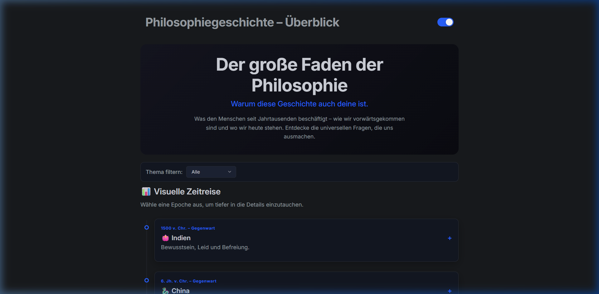

# History of Philosophy (Philosophiegeschichte)

**Version 1.2 – 2026‑08‑28**

*Read this in [German](readme.md).*

[](https://isma1973.github.io/Philosophiegeschichte/)



A fully modular, data-driven learning platform for the global history of philosophy –
from the wisdom traditions of Asia to the present day.
With **61 dynamically rendered philosopher profiles**, 10 era modules, an interactive
timeline, quiz engine, theme system and ARIA-optimized UI —
fully usable offline and without a build process.

## Features

- **Global Timeline:** 10 historical eras (India, China, Islamic World, Japan, Antiquity, Middle Ages, Early Modern, Modern, 20th Century, Contemporary) as an accessible accordion structure.
- **Philosophical Filters:** Thematic filtering by Ontology, Epistemology, Ethics, Aesthetics, Logic, Metaphysics, Language, Power, Mind, and Being.
- **Data-Driven Profiles:** 61 philosopher profiles, centrally maintained in `PHILOSOPHERS[]`. Each profile page identifies the philosopher via URL and renders content dynamically into empty HTML containers.
- **Quiz Engine:** Randomized questions, answer shuffling, and direct score calculation per era.
- **Theme Engine:** Native Dark/Light Mode with persistent state via `localStorage`.
- **UI Components:** Lightbox, Modal, Tooltip, Toast, Tabs, Dropdown — all in independent Vanilla JS modules.
- **Zero-Build:** Pure HTML/CSS/JS, works offline directly via `file://`.
- **ARIA-Optimized:** Accessible attributes on all interactive elements.
- **Performance:** `.webp` image format, modular CSS Grid system.

## ⚡ Performance

In the tested version, the platform consistently achieves **100/100** in all Lighthouse core categories:

- Performance
- Accessibility
- Best Practices
- SEO

## Getting Started

### Open Directly

Open `index.html` in your file explorer or via VS Code in your browser.
The application only uses local files and therefore works via `file://` without an internet connection.

## Project Structure

```text
Philosophiegeschichte/
├── index.html                   # Homepage (Timeline & Filters)
├── quiz.html                    # Interactive Quiz Module
├── philosophen/                 # 10 era articles + 61 individual profiles
│   ├── antike.html
│   ├── china.html
│   ├── indien.html
│   ├── islam.html
│   ├── japan.html
│   ├── mittelalter.html
│   ├── neuzeit.html
│   ├── moderne.html
│   ├── 20jh.html
│   ├── gegenwart.html
│   └── [name].html              # Individual philosopher profiles (61 files)
├── assets/
│   ├── css/                     # Modular UI system (5 layers)
│   │   ├── core.css             # Design Tokens & Reset
│   │   ├── core-theme.css       # Dark/Light-Mode variables
│   │   ├── core-ui.css          # Base components
│   │   ├── custom.css           # Project-specific overrides
│   │   └── ui-kit.css           # Reusable UI building blocks
│   ├── img/                     # .webp era images
│   └── js/                      # 12 Vanilla JS modules
│       ├── philosopher-profile.js  # Central database (61 profiles) & templating (68 KB)
│       ├── quiz.js                 # Quiz engine with shuffling & scoring (36 KB)
│       ├── theme.js                # Dark/Light Mode via localStorage
│       ├── timeline.js             # Accordion timeline with ARIA
│       ├── lightbox.js             # Image lightbox
│       ├── modal.js                # Modal dialog
│       ├── tooltip.js              # Tooltip component
│       ├── toast.js                # Toast notifications
│       ├── tabs.js                 # Tab navigation
│       ├── dropdown.js             # Dropdown menu
│       ├── switches.js             # Toggle switches
│       └── core-ui.js              # UI bootstrap
└── docs/                        # Documentation of the modular UI system
```

## Core Modules

### Visual Timeline (`timeline.js`)
Reads era data from the page source and renders accessible accordion cards with ARIA attributes (`aria-expanded`, `aria-controls`). The filter dropdown sorts eras by core philosophical themes in real time — without page reload.

### Database & Templating (`philosopher-profile.js`)
The heart of the project: **68 KB** central database with all 61 philosopher profiles in the `PHILOSOPHERS[]` array. Each profile page is an empty HTML shell. On load, the module identifies the matching entry via filename and fills all fields dynamically — no duplicated HTML code.

### Quiz Engine (`quiz.js`)
**36 KB** lightweight module: pulls random questions per era from the dataset, shuffles answer options, shows direct feedback per question and calculates the final score.

### Theme Engine (`theme.js`)
Toggles between Dark and Light Mode via class switching on the `<html>` element. The chosen mode is saved in `localStorage` and automatically restored on next visit.

### Modular CSS System (`assets/css/`)
Five-layer architecture:
1. `core.css` — Design Tokens (colors, spacing, fonts) & CSS Reset
2. `core-theme.css` — CSS Custom Properties for Dark/Light Mode
3. `core-ui.css` — Base typography, layout primitives
4. `ui-kit.css` — Reusable components (cards, buttons, badges)
5. `custom.css` — Project-specific aesthetics & overrides

## Technical Notes

- **Stack:** Pure HTML5, CSS3, and Vanilla JavaScript — no React, Vue, or Angular dependency.
- **No Build Process:** No NPM, Webpack, or Vite required.
- **Offline-capable:** Works fully via `file://` without a web server.
- **Data Architecture:** One central JS array as data source for all 61 profiles — no duplicated HTML code.
- **Accessibility:** ARIA attributes on all interactive elements (accordion, filter, quiz).

## Project License

The project is licensed under the [MIT License](LICENSE). You are free to use, modify, and distribute it.
